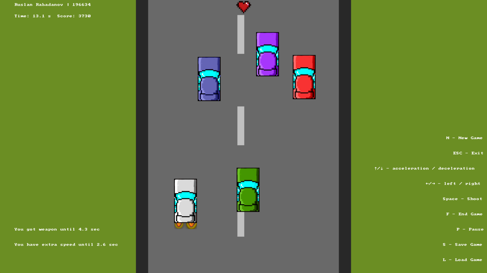

# SpyHunter

SpyHunter is a desktop application based on the Atari game of the same name. The objective of the game is to drive down roads and destroy enemy vehicles using the available weapons. The project is based on the Atari 2600 version of the game.

## Features

- 2D Gameplay: The game is developed using the SDL 2.0 library, providing a 2D gaming experience.
- Enemy and Allied Vehicles: The game includes both enemy and allied vehicles. Destroying enemy vehicles rewards the player with points, while destroying allies incurs a penalty.
- Vehicle Collisions and Shooting: The player can collide with cars and shoot at them to eliminate the enemies.
- Enemy AI: Enemy vehicles actively try to harm the player, increasing the challenge.
- Bonuses: Throughout the game, the player can collect bonuses that improve shooting abilities or speed up the player's vehicle.
- Lives: The game provides a limited number of lives, and the game ends when all lives are depleted.
- User Interface: The game includes an interface that allows users to start the game, view saved results from previous games (sorted by time or points), pause the game, and save or load the game status from a file on their computer.

## Gameplay

